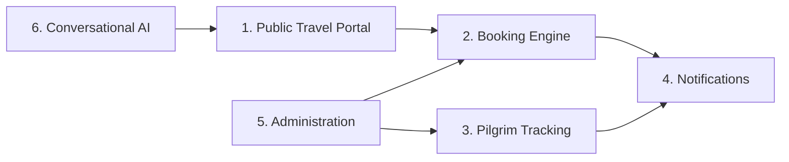
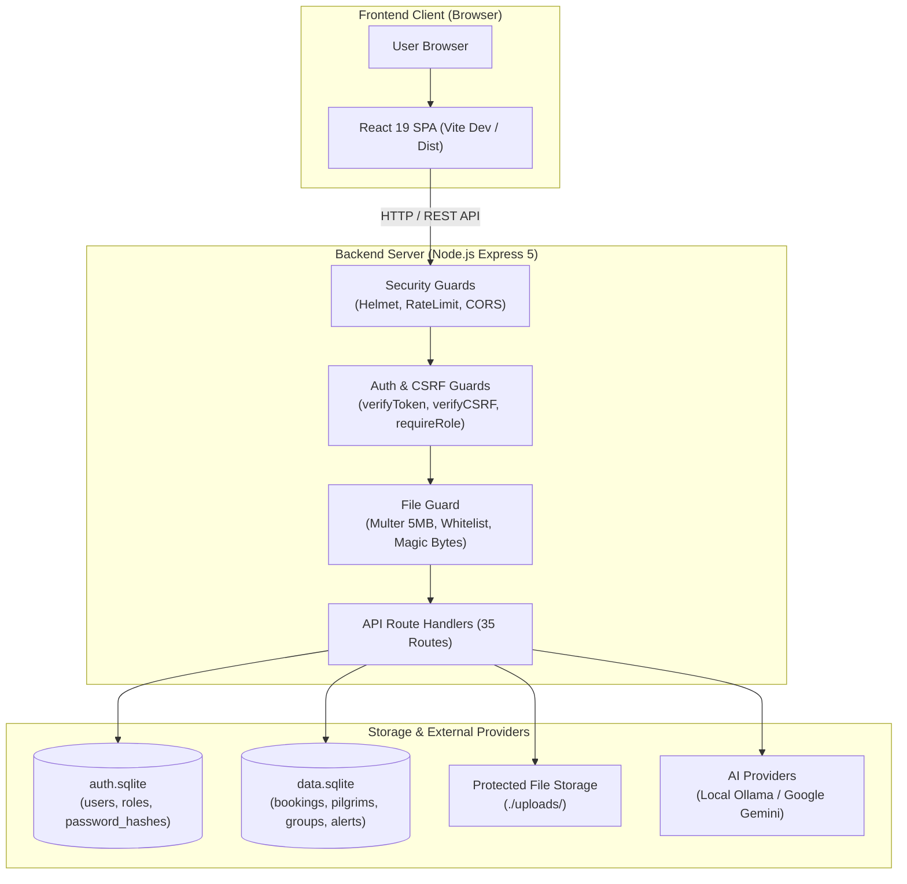
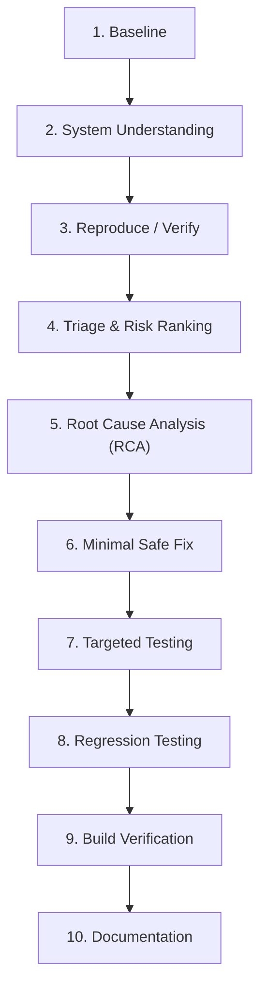

# 1 - Project Overview

[← Return to README](../README.md) | [Next: System Architecture →](02-system-architecture.md)

---

## 1.1 Introduction

The **Kuwait Travel & Tourism Platform** (`kuwait-travel`) is a full-stack web application developed for travel agency operations, customer bookings, religious pilgrimage tracking, and administrative governance. Designed for travel operators handling domestic and regional Middle East tourism, the platform integrates customer-facing discovery, interactive reservation management, specialized regulatory tracking for Hajj and Umrah pilgrims, and an artificial intelligence voice assistant.

Originally developed as a functional prototype, the application underwent a comprehensive engineering evaluation, application security assessment, and systematic hardening process. This documentation details the architecture, discovered defects, security vulnerabilities, targeted remediations, and empirical verification methodologies applied across the platform.

---

## 1.2 Project Objectives

The project balances business and operational functionality with rigorous security engineering standards:

### Functional Objectives
- **Travel Discovery & Booking:** Enable travelers to browse holiday destinations, request international visas, book flights and accommodations, and submit inquiries.
- **Pilgrim Lifecycle Governance:** Provide travel agents with operational oversight of pilgrims visiting the Kingdom of Saudi Arabia, tracking entry dates against standard 90-day visa validity ceilings and issuing automated escalation alerts.
- **Role-Based Portals:** Provide partitioned workspaces for general customers (`user`), travel coordinators (`agent`), and system overseers (`admin`).
- **Multimodal AI Assistance:** Facilitate conversational voice and text customer support in Arabic using local and cloud-based Large Language Models (LLMs) with automated speech synthesis.

### Security Objectives
- **Defensive Engineering:** Eliminate fundamental architectural oversights including plaintext credential storage, unauthenticated administrative endpoints, and broken access controls.
- **Object-Level Authorization:** Guarantee that customer identity is enforced server-side from cryptographically signed tokens, preventing unauthorized enumeration of bookings, notifications, and pilgrim documents.
- **Content & File Validation:** Enforce multi-tier validation on user file uploads to defend against remote code execution, storage exhaustion, and cross-site scripting (XSS).
- **Empirical Verification:** Validate every code modification against positive, negative, boundary, and regression tests without breaking existing application workflows.

---

## 1.3 Main Application Areas

The platform is organized into six core operational domains:

### 1. Public Travel Portal
- Destination showcases covering regional and international packages (Dubai, Cairo, Istanbul, Malaysia, Makkah, Madinah).
- Information pages detailing visa criteria, requirements, and interactive contact forms.
- Interactive arithmetic CAPTCHA challenges protecting authentication dialogs from automated credential stuffing.

### 2. Booking Engine
- Multi-service reservation workflows for flights, hotels, visa processing, passport renewal assistance, and Umrah travel.
- Client-side document attachment supporting passport photo submission.
- Real-time customer dashboard displaying current booking progress, reference numbers, and review states.

### 3. Pilgrim Management (`PilgrimsManager`)
- Purpose-built operational workflow for travel agents managing pilgrim groups.
- Real-time tracking of elapsed stay versus the 90-day Saudi visa limitation.
- Automated yellow and red status alerts triggered when pilgrims reach 70+ elapsed days.
- Bulk batch import of pilgrim manifests via Excel spreadsheets (`.xlsx`) and Arabic HTML report generation.

### 4. Notifications System
- In-app notification bell and feed reflecting booking updates, passport delivery status, and administrative alerts.
- Unread badge tracking with per-user dismissal and bulk read endpoints.

### 5. Administration Dashboard (`AdminDashboard`)
- System-wide metric monitoring: aggregate counts of registered users, active bookings, contact inquiries, and unhandled requests.
- Administrative user management supporting granular role transitions (`user` $\leftrightarrow$ `agent` $\leftrightarrow$ `admin`).
- Centralized review, status updating, and cancellation of customer bookings and messages.

### 6. AI & Voice Services (`VoiceAssistant`)
- Conversational assistant embedded in the client interface supporting spoken and typed Arabic inquiries.
- Dual-provider LLM support: local Ollama inference (`qwen2.5:1.5b`) for offline reliability and Google Gemini REST streaming for complex reasoning.
- Real-time text-to-speech (TTS) synthesis with automated audio caching on disk.

---

## 1.4 Technology Stack

The platform is built on modern JavaScript and Node.js technologies:

| Technology | Version / Component | Role in Platform |
|---|---|---|
| **React** | 19.2.0 | Reactive component architecture, UI state management, and hooks |
| **React Router** | 7.10.0 | Client-side routing, protected navigation guards, and role redirects |
| **Vite** | 7.2.4 | High-performance client bundling, HMR, and development API proxy |
| **Node.js** | 24.12.0 (ESM) | Asynchronous backend runtime environment |
| **Express** | 5.2.1 | REST API framework, middleware pipeline, and route handling |
| **SQLite** | 5.1.1 (`sqlite3` 5.1.7) | Embedded relational database storage (`auth.sqlite` and `data.sqlite`) |
| **bcryptjs** | 2.4.3 | Cryptographic password hashing using salt cost factor 10 |
| **jsonwebtoken** | 9.0.2 | Stateless JSON Web Token generation, signing, and verification |
| **Helmet** | 8.1.0 | HTTP response header security hardening |
| **CSRF Protection** | Custom Middleware | Double-Submit Cookie Pattern with `X-CSRF-Token` header verification |
| **Multer** | 2.0.2 | Multipart/form-data upload pipeline with disk streaming limits |
| **Ollama API** | REST (`localhost:11434`) | Local on-premise LLM inference using quantized models |
| **Google Gemini** | `@google/genai` 0.1.1 | Cloud LLM streaming completions for domain inquiries |
| **LangChain** | 1.2.3 | Extensible LLM abstractions and prompt template management |

---

## 1.5 High-Level Architecture

The platform architecture follows a decoupled client-server paradigm with dedicated identity and operational storage:

### The Dual SQLite Database Architecture

Rather than maintaining all tables in a single SQLite file, the platform employs physical database segregation:

1. **`auth.sqlite` (Identity & Credential Database):**
   - Contains the `users` table storing account identities, email addresses, phone numbers, role definitions (`user`, `agent`, `admin`), account types (`individual`, `company`), and bcrypt password hashes.
   - Strictly isolated from business logic queries. Only accessed by authentication, profile, and administrative role assignment endpoints.

2. **`data.sqlite` (Operational Business Database):**
   - Contains operational tables: `bookings`, `messages`, `destinations`, `pilgrims`, `pilgrim_groups`, and `alerts`.
   - Manages all travel reservations, customer inquiries, and regulatory pilgrim tracking.

This physical boundary minimizes the blast radius of operational SQL injection or logic bugs: queries manipulating bookings or pilgrim manifests have no mechanical access to the authentication database.

---

## 1.6 Security Assessment Approach

The security hardening lifecycle followed a structured, empirical engineering methodology:

1. **Baseline:** Execute initial builds and test scripts to record the unhardened runtime behavior.
2. **System Understanding:** Perform static analysis of routes, SQL queries, middleware hierarchies, and client components.
3. **Reproduce / Verify:** Formulate targeted automated test scripts that actively trigger the vulnerability without destructive payloads.
4. **Triage & Risk Ranking:** Categorize findings by severity, distinguishing reliability bugs from exploit paths.
5. **Root Cause Analysis (RCA):** Isolate the exact architectural weakness responsible for the behavior.
6. **Minimal Safe Fix:** Apply surgical modifications directly resolving the defect without altering adjacent business logic.
7. **Targeted Testing:** Execute positive, negative, and edge-case tests against the modified endpoint.
8. **Regression Testing:** Re-run test suites across previously resolved findings to guarantee zero side effects.
9. **Build Verification:** Run cold restarts and Vite production builds to verify zero compilation or startup errors.
10. **Documentation:** Record problem statements, root causes, remediation diffs, and verification proof.

---

## 1.7 Initial Engineering Findings

During the initial assessment, defects were strictly classified into two categories:

### Reliability & System Configuration Defects
- **BUG-001 (Data Loss on Startup):** The database initialization script dropped and recreated the `pilgrims` table on every server restart.
- **BUG-002 (Missing Alerts Schema):** The database schema failed to declare the `alerts` table, causing unhandled 500 exceptions during alert checks.
- **BUG-003 (Working-Directory Path Sensitivity):** Database connections relied on relative paths (`./auth.sqlite`), causing database splits when scripts executed from different directories.
- **BUG-004 (ES Module Initialization Race):** Static module imports hoisted AI services before `dotenv.config()` executed, resulting in undefined API keys during startup.
- **BUG-005 (Credential Exposure in Source):** Third-party Google API keys were hardcoded directly in server scripts.

### Application Security Vulnerabilities
- **SEC-01 (Stored Plaintext Passwords):** User passwords were saved and verified in plaintext across registration, authentication, and seed scripts.
- **SEC-02 (Missing Server-Side Authorization):** All administrative and operational endpoints lacked authentication and authorization checks; access control existed only as frontend navigation hiding.
- **SEC-03 (Broken Object-Level Authorization / BOLA):** Endpoints trusted client-supplied query parameters (e.g., `phone` or `agent_id`) allowing users to view any customer's bookings or pilgrim documents.
- **SEC-04 (Unrestricted File Upload):** Passport upload endpoints accepted files of arbitrary extension, MIME type, and size, saving them to a publicly exposed static directory.
- **SEC-06 (Global Rate Limiting Misconfiguration):** A strict 100 requests / 15-minute global rate limit conflicted with a 10-second client notification poll, inadvertently blocking legitimate users.
- **SEC-07 (Wildcard CORS Policy):** The Express server permitted unconstrained cross-origin requests from any origin.

---

## 1.8 Security Remediation Summary

All five reliability bugs and four primary critical security vulnerabilities were systematically remediated:

| Finding ID | Domain | Remediation Strategy | Verification |
|---|---|---|:---:|
| **BUG-001** | Data Persistence | Removed destructive `DROP TABLE`, implemented additive migrations | Verified |
| **BUG-002** | Schema Integrity | Added missing `alerts` table definition to `initDb()` | Verified |
| **BUG-003** | Database Paths | Resolved paths via `path.resolve(__dirname, '..')` in `server/db.js` | Verified |
| **BUG-004** | Module Loading | Created `server/env.js` pre-import module ensuring `.env` loads first | Verified |
| **BUG-005** | Credential Hygiene | Rotated exposed keys; moved all secrets to `.env` with `.env.example` | Verified |
| **SEC-01** | Credential Security | Migrated all database accounts to bcrypt (cost factor 10) | Verified |
| **SEC-02** | Auth & RBAC | Implemented JWT in `HttpOnly` cookies, Double-Submit CSRF, and RBAC | Verified |
| **SEC-03** | BOLA / IDOR | Bound object queries directly to validated `req.user.id` | Verified |
| **SEC-04** | Upload Security | Implemented 5MB limit, extension whitelist, magic bytes, and auth check | Verified |

*(Note: Findings SEC-06 and SEC-07 remain documented as known architectural limitations for future enhancement).*

---

## 1.9 Verification Philosophy

Fixes were not considered complete until subjected to multi-layered empirical verification:

- **Positive Tests:** Validating that legitimate users with correct credentials, valid tokens, and authorized roles perform operations successfully.
- **Negative Tests:** Submitting expired tokens, forged signatures, invalid passwords, malformed payloads, and oversized files to verify expected rejections.
- **Authorization & Boundary Tests:** Ensuring normal `user` accounts receive `403 Forbidden` on agent/admin endpoints, and that agents cannot access resources belonging to peers.
- **Regression Tests:** Executing all test scripts in sequence to ensure new controls did not regress earlier fixes.
- **Cold Restart Tests:** Terminating and rebooting the server process to verify that migrations, schema definitions, and token configurations persist without manual intervention.
- **Production Build Tests:** Compiling the frontend application using `npm run build` to guarantee zero bundling errors or syntax incompatibilities.

---

## 1.10 Repository Documentation Structure

This portfolio documentation is structured into the following nine detailed chapters:

1. **[01 - Project Overview](01-project-overview.md):** Architectural baseline, business context, and defect landscape *(Current Chapter)*.
2. **[02 - System Architecture](02-system-architecture.md):** Component boundaries, database segregation, and runtime request flows.
3. **[03 - Security Assessment](03-security-assessment.md):** Initial audit findings, threat modeling, and root cause analysis.
4. **[04 - System Hardening](04-system-hardening.md):** Resolution of reliability and configuration defects (BUG-001 through BUG-005).
5. **[05 - Authentication & Authorization](05-authentication-and-authorization.md):** Remediation of SEC-01 and SEC-02 (bcrypt, JWT cookies, CSRF, and RBAC).
6. **[06 - BOLA / IDOR Remediation](06-bola-idor-remediation.md):** Remediation of SEC-03 (ownership binding on bookings, notifications, and pilgrims).
7. **[07 - Secure File Uploads](07-secure-file-uploads.md):** Remediation of SEC-04 (validation pipeline, magic bytes, and protected storage).
8. **[08 - Security Testing](08-security-testing.md):** Test suites, empirical verification counts, and regression methodologies.
9. **[09 - Final Security Status](09-final-security-status.md):** Verified security posture, defensive controls summary, and remaining limitations.

---

## 1.11 Next Chapter

Continue to the architectural breakdown:  
👉 **[2 - System Architecture](02-system-architecture.md)**
