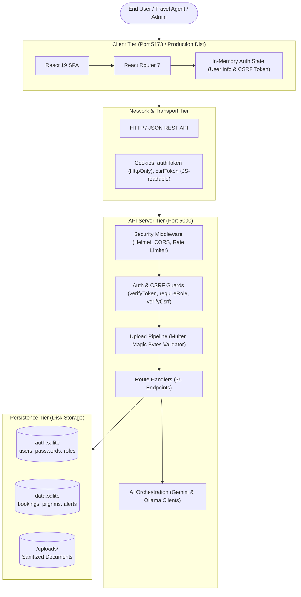
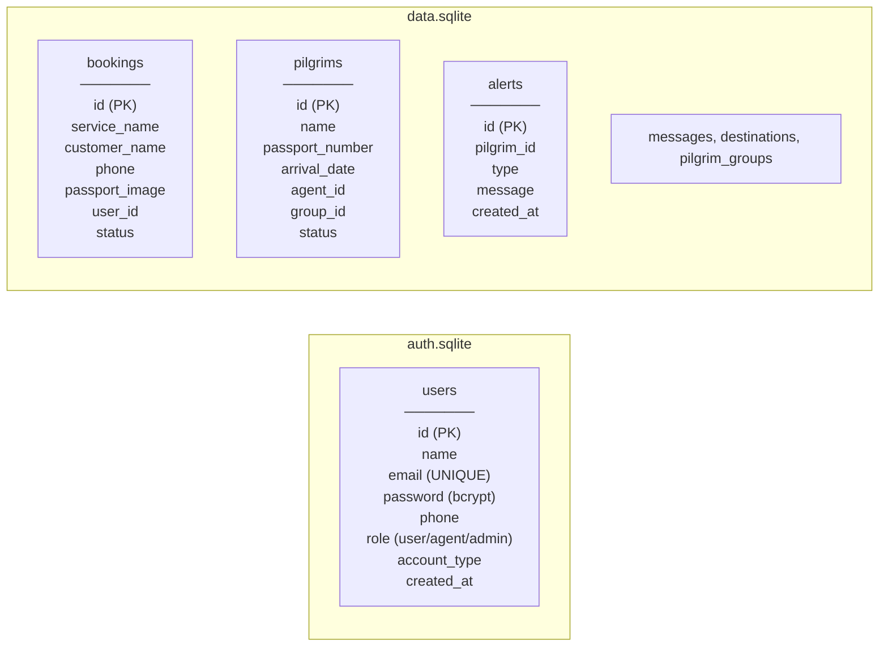
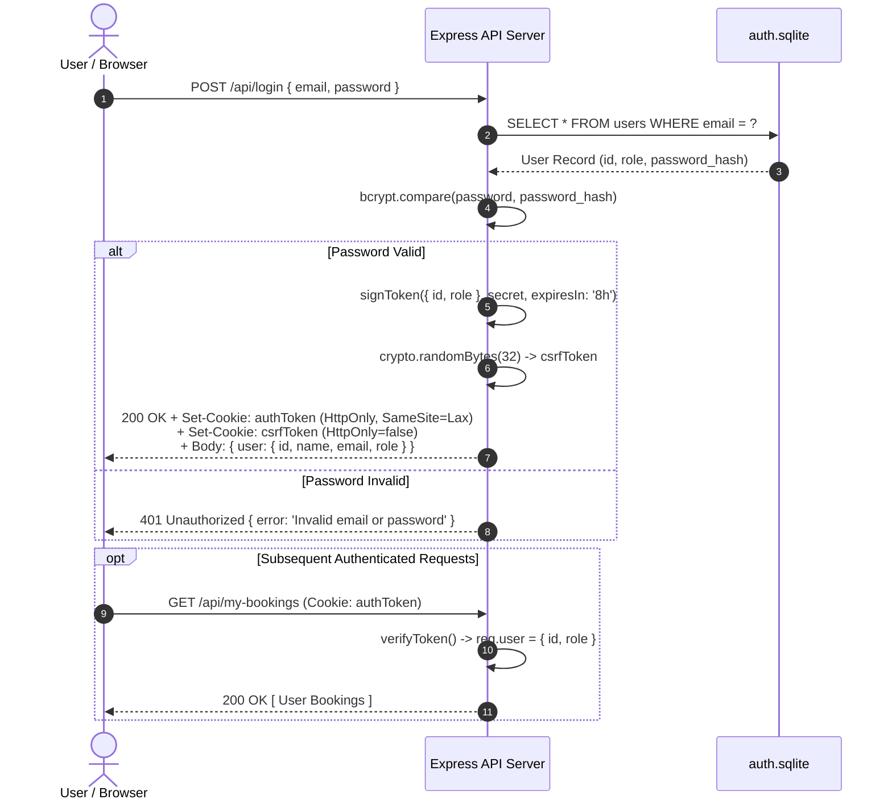
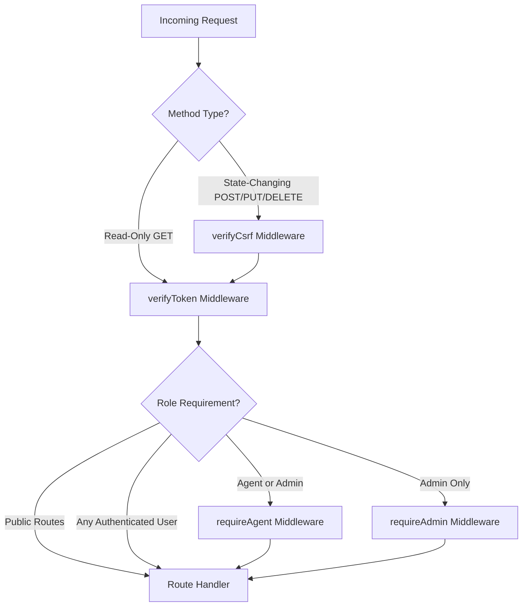
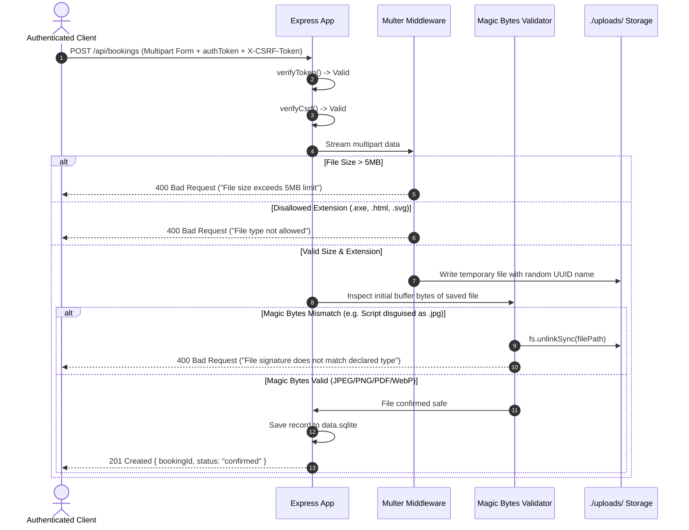
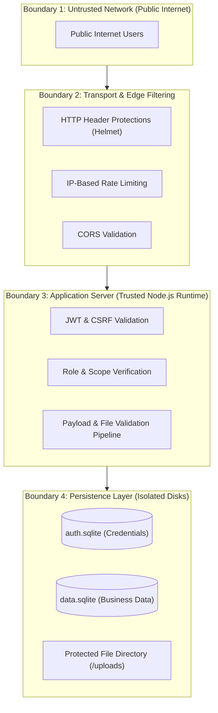

# 2 - System Architecture

[← Return to Chapter 1: Project Overview](01-project-overview.md) | [Next: Security Assessment →](03-security-assessment.md)

---

## 2.1 Overview

The **Kuwait Travel & Tourism Platform** employs a decoupled client-server architecture. The user interface is a single-page application (SPA) running React 19, bundled and served via Vite. The backend service is an Express 5 application executing on Node.js using native ECMAScript Modules (ESM). Data management is partitioned across two physically separate SQLite databases, isolating security-critical authentication credentials from operational business entities.

---

## 2.2 Frontend

The frontend is implemented as a client-side rendered (CSR) React 19 single-page application with modular routing provided by React Router 7:

- **Component Structure:**
  - `src/App.jsx`: Core routing engine, navigation header, hero presentation, dynamic destination catalog, inquiry modal dialogs, and authentication dialogs.
  - `src/AdminDashboard.jsx`: Administrative dashboard featuring system metrics, booking oversight, customer inquiry management, and user role updates.
  - `src/UserDashboard.jsx`: Customer portal displaying user profile details and personalized booking records.
  - `src/PilgrimsManager.jsx`: Dedicated operations portal for travel agents to monitor pilgrim visa durations, upload Excel manifests, review 70+ day warnings, and export reports.
  - `src/VoiceAssistant.jsx`: Interactive modal assistant utilizing the browser Web Speech API for voice capture, backend AI streaming for response synthesis, and audio streaming for speech output.
- **State Management & Credentials:**
  - User session identity is held in React state (`user`), initialized at boot by querying `GET /api/auth/me`.
  - **No sensitive tokens are stored in `localStorage` or `sessionStorage`**, preventing token exfiltration via Cross-Site Scripting (XSS).
  - The browser natively manages the `authToken` cookie (`HttpOnly`). For state-changing operations (POST, PUT, DELETE), client JavaScript reads the `csrfToken` cookie and transmits its value in the `X-CSRF-Token` HTTP header.

---

## 2.3 Backend

The backend is built with Express 5 running on Node.js:

- **Entrypoint & Initialization (`server/index.js`):**
  - Configures security headers via `helmet()`.
  - Sets up global rate limiting (100 requests per 15-minute window per IP).
  - Initializes parsing middleware: `express.json()`, `express.urlencoded({ extended: true })`, and `cookieParser()`.
  - Connects to SQLite databases and executes additive table migrations.
- **Modular Services:**
  - `server/middleware/auth.js`: Implements `verifyToken`, `requireAdmin`, `requireAgent`, and `verifyCsrf`.
  - `server/db.js`: Canonical database connection manager providing thread-safe SQLite handles via absolute path resolution.
  - `server/env.js`: Environment configuration loader guaranteeing pre-import execution in ES module lifecycles.
  - `server/aiService.js`, `server/geminiService.js`, `server/ollamaService.js`: Multi-provider LLM integrations.
  - `server/ttsService.js`: Cloud text-to-speech audio generator with persistent disk caching.

---

## 2.4 Database Separation

The persistence tier physically decouples authentication records from operational business data:

### Architectural Benefits:
1. **Isolation of Credentials:** Even if an operational query vulnerability is exploited against `data.sqlite`, SQLite cannot execute cross-database queries or joins across separate file handles, preventing access to password hashes in `auth.sqlite`.
2. **Independent Backup & Migration:** Security credentials and business operational records can be snapshotted, rotated, and backed up independently.
3. **Data Integrity:** Table creation scripts for business records cannot inadvertently alter or lock identity schemas.

---

## 2.5 Authentication Flow

Authentication is stateless, relying on JSON Web Tokens stored exclusively in secure, browser-managed cookies:

### Token Configuration Details:
- **`authToken` Cookie:**
  - `httpOnly: true`: Inaccessible to `document.cookie` or client-side JavaScript.
  - `sameSite: 'lax'`: Prevents ambient cross-site transmission during third-party requests while supporting top-level navigations.
  - `secure: process.env.NODE_ENV === 'production'`: Ensures cookies are transmitted solely over HTTPS in production.
  - `maxAge: 8 hours`: Enforces token expiration.
- **`csrfToken` Cookie:**
  - `httpOnly: false`: Readable by JavaScript to extract and inject into the `X-CSRF-Token` request header for state-changing requests.

---

## 2.6 Authorization Flow

Authorization in the platform is **layered and contextual**. Not all routes share the same middleware chain; endpoints are secured strictly according to the minimum privilege required:

### Endpoint Classification Across 35 Routes:

1. **Intentionally Public Routes (10 Routes):**
   - Health checks: `GET /api/test`, `GET /api/health`, `GET /api/ai/status`.
   - Public catalogs: `GET /api/destinations`, `GET /api/offers`.
   - Contact & CAPTCHA: `POST /api/contact`, `GET /api/captcha`, `GET /api/captcha/audio`.
   - Auth entrypoints: `POST /api/register`, `POST /api/login`.
2. **Authenticated Routes (12 Routes):**
   - User profile & session: `GET /api/auth/me`, `POST /api/logout`.
   - User bookings & notifications: `GET /api/my-bookings`, `POST /api/bookings`, `GET /api/notifications`, `POST /api/notifications/read`.
   - Directory lookups: `GET /api/agents`, `GET /api/groups`, `GET /api/pilgrims`, `GET /api/pilgrims/export-pdf`.
   - AI interactions: `POST /api/ai/chat`, `POST /api/ai/generate`, `POST /api/tts`.
3. **Agent or Administrator Routes (5 Routes):**
   - Operational pilgrim management: `POST /api/groups`, `POST /api/pilgrims`, `POST /api/pilgrims/bulk`, `GET /api/pilgrims/check-alerts`, `PUT /api/pilgrims/:id/status`.
4. **Administrator Only Routes (8 Routes):**
   - Back-office administration: `GET /api/admin/stats`, `GET /api/admin/users`, `PUT /api/admin/users/:id/role`, `GET /api/admin/bookings`, `PUT /api/admin/bookings/:id`, `GET /api/admin/messages`, `DELETE /api/admin/messages/:id`, `POST /api/admin/send-notification`.

---

## 2.7 File Upload Flow

Document uploads (e.g., passport images during booking) pass through a multi-stage defense-in-depth pipeline before reaching disk storage:

---

## 2.8 Security Boundary

The system maintains four clear security boundaries:

1. **Perimeter Boundary:** Rejects unconstrained burst traffic, strips dangerous framing headers via Helmet, and inspects request lengths.
2. **Authentication Boundary:** Verifies cryptographic token signatures before granting execution access to protected controllers.
3. **Object-Level Boundary:** Maps data queries directly to the authenticated user ID (`req.user.id`), preventing cross-tenant data leakage.
4. **Data Isolation Boundary:** Enforces physical database file separation, ensuring operational queries have no direct file path or descriptor access to credential stores.

---

## 2.9 Design Principles

The architecture follows five core software engineering principles:

1. **Defense in Depth:** Security controls are stacked sequentially (Rate Limiting $\rightarrow$ Header Hardening $\rightarrow$ JWT Verification $\rightarrow$ CSRF Check $\rightarrow$ Role Inspection $\rightarrow$ Magic Bytes Validation).
2. **Principle of Least Privilege:** Normal users cannot view administrative stats or peer records; agents can manage pilgrims but cannot modify platform user roles; unauthenticated callers can only access public catalogs.
3. **Fail-Closed Default:** If an authentication token is malformed, expired, missing, or signed with an unrecognized key, the middleware halts processing immediately with `401 Unauthorized`.
4. **Zero Client Trust:** Identifiers supplied via query parameters or body payloads (`phone`, `agent_id`, `role`) are never trusted for authorization; user identity is derived exclusively from the verified server token.
5. **Separation of Concerns:** Business data (`data.sqlite`), authentication credentials (`auth.sqlite`), uploaded files (`/uploads`), and AI inference services are isolated into modular components.

---

## 2.10 Next Chapter

Examine the baseline security audit and vulnerability assessment:  
👉 **[3 - Security Assessment](03-security-assessment.md)**
