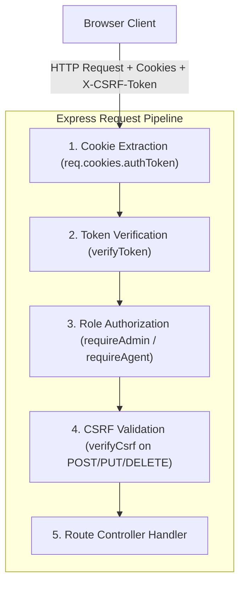

# 5 - Authentication & Authorization

[← Return to Chapter 4: System Hardening](04-system-hardening.md) | [Next: BOLA / IDOR Remediation →](06-bola-idor-remediation.md)

---

## 5.1 Overview

The initial assessment revealed two critical security vulnerabilities at the core of the platform's access control architecture:
1. **SEC-01:** Passwords stored and evaluated in plaintext across all database accounts.
2. **SEC-02:** Complete lack of server-side authorization across API endpoints, leaving administrative and operational functions accessible without authentication.

This chapter details the cryptographic migration to salted bcrypt password hashing and the design of a stateless, cookie-anchored JWT authentication and role-based access control (RBAC) architecture with Double-Submit CSRF protection.

---

## 5.2 SEC-01: Cryptographic Password Storage (Bcrypt Migration)

### The Original Weakness
In the baseline system, user passwords across all accounts (users, travel agents, and administrators) were inserted directly as plaintext strings into `auth.sqlite`. During authentication, the login endpoint queried the user record by email and executed an unhashed string comparison:
```javascript
// Baseline vulnerability: Plaintext comparison in POST /api/login
if (!user || user.password !== password) {
    return res.status(400).json({ error: 'Invalid email or password' });
}
```
Any read access to the database or backups immediately exposed all credentials in the clear.

### Bcrypt Migration Architecture
To remediate SEC-01, the system was migrated to `bcryptjs` using a cost factor of 10 ($2^{10} = 1024$ key expansion rounds):

1. **Transactional, Idempotent Database Migration:**
   - A dedicated migration script inspected every record in `auth.sqlite`.
   - For each account, the script verified whether the existing string was already a bcrypt hash (matching the `$2a$` or `$2b$` prefix).
   - Unhashed passwords were processed using `bcrypt.hash(pwd, 10)`.
   - Before committing each update, the script performed an immediate verification check (`bcrypt.compare(pwd, hash)`) inside a database transaction.
2. **Registration Pipeline Hardening:**
   - In `POST /api/register`, raw passwords are now hashed immediately upon receipt before executing the `INSERT` query:
   ```javascript
   const hashedPassword = await bcrypt.hash(password, 10);
   await authDb.run(
       "INSERT INTO users (name, email, password, phone, account_type, role) VALUES (?, ?, ?, ?, ?, ?)",
       [name, email, hashedPassword, phone, account_type || 'individual', 'user']
   );
   ```
3. **Login Verification:**
   - In `POST /api/login`, credential verification utilizes constant-time comparison:
   ```javascript
   const isMatch = await bcrypt.compare(password, user.password);
   if (!isMatch) {
       return res.status(401).json({ error: 'Invalid email or password' });
   }
   ```
4. **Password Leakage Prevention:**
   - All SQL `SELECT` queries across user profile and administrative user endpoints were modified to exclude the `password` column entirely:
   ```javascript
   const user = await authDb.get(
       "SELECT id, name, email, phone, role, account_type FROM users WHERE id = ?",
       [req.user.id]
   );
   ```
   - User objects returned in API responses and console logs never include password fields.

---

## 5.3 SEC-02: Stateless Server-Side Authentication & Authorization

### The Original Weakness
Access control in the baseline application existed solely as client-side conditional rendering in React components (e.g., hiding the `AdminDashboard` button if `user.role !== 'admin'`). The backend Express API server exposed all administrative endpoints (`/api/admin/*`) without any authentication or authorization guards. Anyone could send a raw HTTP request and access administrative data or mutate user roles.

### Architectural Solution
A stateless JWT-based architecture was implemented, utilizing secure, browser-managed cookies rather than `localStorage` or `sessionStorage`.



### 1. Token Generation & Storage
Upon successful authentication, the server generates a signed JSON Web Token (JWT) with minimum identity claims:
```javascript
function signAuthToken(userId, userRole) {
    return jwt.sign(
        { id: userId, role: userRole },
        process.env.JWT_SECRET,
        { algorithm: 'HS256', expiresIn: '8h' }
    );
}
```
The token is transmitted to the client inside an `HttpOnly` cookie:
```javascript
function setAuthCookie(res, token) {
    const isProd = process.env.NODE_ENV === 'production';
    res.cookie('authToken', token, {
        httpOnly: true,
        secure: isProd,
        sameSite: isProd ? 'strict' : 'lax',
        maxAge: 8 * 60 * 60 * 1000, // 8 hours
        path: '/'
    });
}
```

> [!IMPORTANT]
> **Why `HttpOnly` Cookies Instead of `localStorage`?**  
> Tokens stored in `localStorage` or `sessionStorage` are fully readable by any JavaScript running on the page. In the event of an XSS vulnerability, malicious scripts can exfiltrate tokens immediately. By storing the JWT in an `HttpOnly` cookie, the browser prevents JavaScript access entirely (`document.cookie` cannot inspect `authToken`), rendering client-side token theft impossible.

### 2. Double-Submit CSRF Protection
Because browser cookies are automatically attached by the browser on cross-origin requests, a Double-Submit Cookie Pattern was implemented for all state-changing operations (`POST`, `PUT`, `DELETE`):

1. **CSRF Cookie Issuance:** Upon login or registration, the server issues a second cookie: `csrfToken` containing 32 cryptographically random bytes (`crypto.randomBytes(32).toString('hex')`).
2. **JavaScript Readability:** Unlike `authToken`, the `csrfToken` cookie has `httpOnly: false`. The React frontend reads this cookie value and injects it into the `X-CSRF-Token` HTTP header on mutating requests.
3. **Middleware Verification (`verifyCsrf`):**
   ```javascript
   export function verifyCsrf(req, res, next) {
       const tokenFromCookie = req.cookies?.csrfToken;
       const tokenFromHeader = req.headers['x-csrf-token'];
       if (!tokenFromCookie || !tokenFromHeader || tokenFromCookie !== tokenFromHeader) {
           return res.status(403).json({ error: 'CSRF token missing or mismatch' });
       }
       next();
   }
   ```
   An external malicious website cannot read the victim's cookies (enforced by the browser's Same-Origin Policy) and therefore cannot populate the matching `X-CSRF-Token` header.

### 3. Role-Based Access Control (RBAC) Middleware

Three composable middleware functions enforce authorization across the route tree:

- **`verifyToken(req, res, next)`:**
  Extracts `authToken` from `req.cookies`. Verifies signature using `process.env.JWT_SECRET` and algorithm `HS256`. Populates `req.user = { id: payload.id, role: payload.role }`. Returns `401 Unauthorized` if token is missing, expired, or corrupted.
- **`requireAdmin(req, res, next)`:**
  Executes after `verifyToken`. Verifies that `req.user.role === 'admin'`. Returns `403 Forbidden` if the user is a normal customer or travel agent.
- **`requireAgent(req, res, next)`:**
  Executes after `verifyToken`. Verifies that `req.user.role === 'admin' || req.user.role === 'agent'`. Returns `403 Forbidden` for standard users.

---

## 5.4 Authoritative Route Security Matrix

Every Express endpoint in `server/index.js` (35 routes total) is classified into exactly one security tier:

| HTTP Method | Route Path | Auth Requirement | Role Requirement | CSRF Protection | Classification |
|:---:|---|:---:|:---:|:---:|:---:|
| `GET` | `/api/test` | None | Public | No | Intentionally Public |
| `GET` | `/api/health` | None | Public | No | Intentionally Public |
| `GET` | `/api/destinations` | None | Public | No | Intentionally Public |
| `GET` | `/api/offers` | None | Public | No | Intentionally Public |
| `POST` | `/api/contact` | None | Public | No | Intentionally Public |
| `GET` | `/api/captcha` | None | Public | No | Intentionally Public |
| `GET` | `/api/captcha/audio` | None | Public | No | Intentionally Public |
| `POST` | `/api/register` | None | Public | No | Intentionally Public |
| `POST` | `/api/login` | None | Public | No | Intentionally Public |
| `GET` | `/api/ai/status` | None | Public | No | Intentionally Public |
| `GET` | `/api/auth/me` | `verifyToken` | Any User | No | Authenticated |
| `POST` | `/api/logout` | None (Clears Cookies) | Public | No | Authenticated / Public |
| `GET` | `/api/agents` | `verifyToken` | Any User | No | Authenticated |
| `GET` | `/api/groups` | `verifyToken` | Any User | No | Authenticated |
| `GET` | `/api/my-bookings` | `verifyToken` | Any User (Own Data) | No | Authenticated |
| `POST` | `/api/bookings` | `verifyToken` | Any User | `verifyCsrf` | Authenticated + CSRF |
| `GET` | `/api/notifications` | `verifyToken` | Any User (Own Data) | No | Authenticated |
| `POST` | `/api/notifications/read` | `verifyToken` | Any User (Own Data) | `verifyCsrf` | Authenticated + CSRF |
| `GET` | `/api/pilgrims` | `verifyToken` | Any User (Scoped) | No | Authenticated |
| `GET` | `/api/pilgrims/export-pdf` | `verifyToken` | Any User (Scoped) | No | Authenticated |
| `POST` | `/api/ai/generate` | `verifyToken` | Any User | No | Authenticated |
| `POST` | `/api/ai/chat` | `verifyToken` | Any User | No | Authenticated |
| `POST` | `/api/tts` | `verifyToken` | Any User | No | Authenticated |
| `POST` | `/api/groups` | `verifyToken` | Agent / Admin | `verifyCsrf` | Agent / Admin + CSRF |
| `POST` | `/api/pilgrims` | `verifyToken` | Agent / Admin | `verifyCsrf` | Agent / Admin + CSRF |
| `POST` | `/api/pilgrims/bulk` | `verifyToken` | Agent / Admin | `verifyCsrf` | Agent / Admin + CSRF |
| `GET` | `/api/pilgrims/check-alerts` | `verifyToken` | Agent / Admin | No | Agent / Admin |
| `PUT` | `/api/pilgrims/:id/status` | `verifyToken` | Agent / Admin | `verifyCsrf` | Agent / Admin + CSRF |
| `GET` | `/api/admin/stats` | `verifyToken` | Admin Only | No | Admin Only |
| `GET` | `/api/admin/users` | `verifyToken` | Admin Only | No | Admin Only |
| `PUT` | `/api/admin/users/:id/role` | `verifyToken` | Admin Only | `verifyCsrf` | Admin Only + CSRF |
| `GET` | `/api/admin/messages` | `verifyToken` | Admin Only | No | Admin Only |
| `DELETE` | `/api/admin/messages/:id` | `verifyToken` | Admin Only | `verifyCsrf` | Admin Only + CSRF |
| `GET` | `/api/admin/bookings` | `verifyToken` | Admin Only | No | Admin Only |
| `PUT` | `/api/admin/bookings/:id` | `verifyToken` | Admin Only | `verifyCsrf` | Admin Only + CSRF |
| `POST` | `/api/admin/send-notification`| `verifyToken` | Admin Only | `verifyCsrf` | Admin Only + CSRF |

---

## 5.5 Verification & Security Testing

Both SEC-01 and SEC-02 were validated using automated integration test scripts:

### SEC-01 Verification (12 Passed / 0 Failed)
- Tested database user records: confirmed all 15 active accounts stored valid bcrypt hashes starting with `$2a$` or `$2b$`.
- Tested authentication: verified valid accounts authenticate successfully; invalid passwords return `401 Unauthorized`.
- Tested new registrations: verified newly registered accounts store bcrypt hashes directly.
- Tested leakage: verified API responses from `/api/auth/me`, `/api/login`, and `/api/admin/users` never contain password fields.

### SEC-02 Verification (36 Passed / 0 Failed)
- **Unauthenticated Access Tests:** Queried all 25 protected endpoints without cookies; verified 100% returned `401 Unauthorized`.
- **Role Escalation Tests:** Authenticated as a standard user (`role: 'user'`) and attempted to access `/api/admin/stats`, `/api/admin/users`, and `POST /api/pilgrims`; verified 100% returned `403 Forbidden`.
- **CSRF Enforcement Tests:** Sent mutating requests (`POST /api/bookings`, `PUT /api/admin/users/:id/role`) with valid auth cookies but missing `X-CSRF-Token` headers; verified 100% returned `403 Forbidden`.
- **Token Tampering Tests:** Mutated payload claims (changing `role: "user"` to `"admin"`) without signing with the secret; verified token verification rejected the forged signature with `401 Unauthorized`.
- **Logout Tests:** Invoked `POST /api/logout`; verified `authToken` and `csrfToken` cookies were cleared by the server.

---

## 5.6 Next Chapter

Examine how Broken Object-Level Authorization (BOLA/IDOR) was eliminated across personal bookings and pilgrim records:  
👉 **[6 - BOLA / IDOR Remediation](06-bola-idor-remediation.md)**
