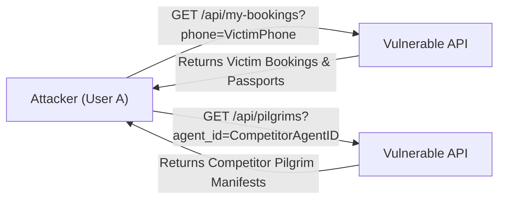

# 6 - BOLA / IDOR Remediation

[← Return to Chapter 5: Authentication & Authorization](05-authentication-and-authorization.md) | [Next: Secure File Uploads →](07-secure-file-uploads.md)

---

## 6.1 Overview

**Broken Object-Level Authorization (BOLA)**, historically cataloged as Insecure Direct Object References (IDOR), occurs when an application exposes internal object identifiers to clients and relies on untrusted client input to determine access rights to specific data records.

During the security assessment of the Kuwait Travel & Tourism Platform, **SEC-03** was identified as a high-severity vulnerability across six core operational endpoints. The system relied on caller-supplied query parameters (such as `phone` or `agent_id`) rather than binding queries to the authenticated session context (`req.user.id`).

---

## 6.2 The Vulnerability: Trusting Client-Controlled Identifiers

In the baseline implementation, API controllers treated query string arguments as authoritative assertions of identity:

```javascript
// Baseline vulnerability in GET /api/my-bookings
app.get('/api/my-bookings', async (req, res) => {
    const { phone } = req.query; // Untrusted user input
    const rows = await dataDb.all("SELECT * FROM bookings WHERE phone = ?", [phone]);
    res.json(rows);
});
```

Because phone numbers and sequential agent IDs are readily guessable or publicly known, any user could enumerate confidential records simply by changing query parameters:



---

## 6.3 Remediated Access Control Model

Under the remediated architecture, access control is enforced by binding requests strictly to the cryptographic identity token extracted from `req.user`. Client-supplied identifiers are never trusted to grant broader access:

```mermaid
graph TD
    UserA["Authenticated User A (id: 101, phone: +965111111)"]
    UserB["Authenticated User B (id: 102, phone: +965222222)"]
    
    subgraph Controller["BOLA Guard Logic in Express Controller"]
        CheckPhone{"Caller supplies phone parameter?"}
        MatchPhone{"Does supplied phone == authUser.phone?"}
        IsAdmin{"Is req.user.role == 'admin'?"}
        Allow["Allow Access: Fetch records for authUser"]
        Deny["Deny Access: Return 403 Forbidden"]
    end
    
    UserA -->|"Requests User A Data"| Controller
    UserA -->|"Requests User B Data"| Controller
    
    CheckPhone -->|No phone provided| Allow
    CheckPhone -->|Phone provided| IsAdmin
    IsAdmin -->|Yes (Admin)| Allow
    IsAdmin -->|No (Standard User)| MatchPhone
    MatchPhone -->|Match| Allow
    MatchPhone -->|Mismatch| Deny
```

### Authorization Rule:
$$\text{User A} \longrightarrow \text{User A Resource} \implies \mathbf{200\ OK\ (Allowed)}$$
$$\text{User A} \longrightarrow \text{User B Resource} \implies \mathbf{403\ Forbidden\ (Blocked)}$$

---

## 6.4 Affected Areas & Implementation Details

Six distinct API endpoints were hardened against object-level authorization bypasses:

### 1. Booking Creation (`POST /api/bookings`)
- **Problem:** Bookings were previously saved with customer contact phone numbers without establishing an immutable foreign key relationship to the authenticated user.
- **Remediation:** Migrated schema to include `user_id INTEGER`. When creating a booking, the controller resolves the authenticated user from `auth.sqlite` and stamps `user_id = authUser.id` directly into `data.sqlite`:
```javascript
const authUser = await authDb.get("SELECT id, name, phone, role FROM users WHERE id = ?", [req.user.id]);
await dataDb.run(
    "INSERT INTO bookings (..., user_id) VALUES (..., ?)",
    [..., authUser.id]
);
```

### 2. User Booking Retrieval (`GET /api/my-bookings`)
- **Problem:** Allowed arbitrary callers to view bookings for any phone number.
- **Remediation:** 
  1. The controller resolves `authUser` from `authDb` using `req.user.id`.
  2. If a non-admin caller supplies a `phone` query parameter that differs from `authUser.phone`, the request is immediately rejected with `403 Forbidden`.
  3. The query binds strictly to `authUser.id` (or the user's phone for legacy records):
```javascript
if (phone && authUser.phone && phone !== authUser.phone) {
    return res.status(403).json({ error: "Access denied: cannot access another user's bookings" });
}
const rows = await dataDb.all(
    "SELECT * FROM bookings WHERE user_id = ? OR (user_id IS NULL AND phone = ?) ORDER BY created_at DESC",
    [authUser.id, authUser.phone || '']
);
```

### 3. Notifications Feed (`GET /api/notifications`)
- **Problem:** Customers could monitor private alerts (such as passport renewals and administrative notices) belonging to other phone numbers.
- **Remediation:** Restricts non-admin callers exclusively to their own registered phone number:
```javascript
if (phone && authUser.phone && phone !== authUser.phone) {
    return res.status(403).json({ error: "Access denied: cannot access another user's notifications" });
}
const rows = await dataDb.all(
    "SELECT * FROM notifications WHERE user_phone = ? ORDER BY created_at DESC",
    [authUser.phone]
);
```

### 4. Notification Dismissal (`POST /api/notifications/read`)
- **Problem:** Any caller could mark all notifications for any user phone as read.
- **Remediation:** Scoped target phone strictly to `authUser.phone` for non-admin accounts:
```javascript
const targetPhone = req.user.role === 'admin' ? (req.body.phone || 'admin') : authUser.phone;
if (targetPhone) {
    await dataDb.run("UPDATE notifications SET is_read = 1 WHERE user_phone = ?", [targetPhone]);
}
```

### 5. Pilgrim Manifest Retrieval (`GET /api/pilgrims`)
- **Problem:** Travel agents could query pilgrim manifests managed by competitor agencies by altering `?agent_id=X`.
- **Remediation:** Enforces agent identity scoping. If an agent supplies an `agent_id` parameter that does not match their own `req.user.id`, the server halts with `403 Forbidden`:
```javascript
if (req.user.role !== 'admin') {
    if (agent_id && parseInt(agent_id) !== req.user.id) {
        return res.status(403).json({ error: "Access denied: cannot view pilgrims assigned to another agent" });
    }
    query += ' AND p.agent_id = ?';
    params.push(req.user.id);
}
```

### 6. Pilgrim Manifest PDF/HTML Export (`GET /api/pilgrims/export-pdf`)
- **Problem:** Allowed bulk export of sensitive pilgrim passport lists belonging to any agency.
- **Remediation:** Applies identical scoping logic as `GET /api/pilgrims`, ensuring agents can only export rosters for which they are the verified managing agent (`agent_id === req.user.id`).

---

## 6.5 Administrative Visibility Preservation

Security hardening must not compromise legitimate back-office workflows. The remediation intentionally preserved overarching oversight for administrative accounts (`role === 'admin'`):

- When an **Administrator** queries `/api/my-bookings`, they can omit `phone` to review all system bookings or supply `?phone=...` as a filter to inspect a specific customer's reservations.
- When an **Administrator** queries `/api/pilgrims`, they can view all active pilgrims nationwide or supply `?agent_id=...` to audit a specific agency's roster.
- When an **Administrator** queries `/api/notifications`, they receive system-wide operational alerts targeted to `'admin'`.

This distinction ensures robust security boundaries for unprivileged tenants while preserving administrative functionality.

---

## 6.6 Cross-User Authorization Verification

The BOLA / IDOR defenses were validated using an automated suite of **32 integration test cases** executed with distinct user sessions:

```text
Suite: SEC-03 BOLA / IDOR Verification
  [PASS] User A cannot access User B bookings via phone query (HTTP 403)
  [PASS] User A cannot access User B notifications via phone query (HTTP 403)
  [PASS] User A cannot mark User B notifications as read (Scoped to User A)
  [PASS] Agent 1 cannot access Agent 2 pilgrims via agent_id query (HTTP 403)
  [PASS] Agent 1 cannot export Agent 2 pilgrims to PDF/HTML (HTTP 403)
  [PASS] User A retrieves own bookings successfully (HTTP 200)
  [PASS] User A retrieves own notifications successfully (HTTP 200)
  [PASS] Agent 1 retrieves own assigned pilgrims successfully (HTTP 200)
  [PASS] Admin retrieves all bookings without restriction (HTTP 200)
  [PASS] Admin can filter bookings by arbitrary phone (HTTP 200)
  [PASS] Admin can view pilgrims across all agents (HTTP 200)
  [PASS] Unauthenticated requests to all 6 endpoints rejected (HTTP 401)
  ... [32 test assertions passed, 0 failed]
```

### Result
**VERIFIED:** Object-level authorization is enforced across all operational endpoints. Client-controlled identifiers cannot bypass data isolation boundaries.

---

## 6.7 Next Chapter

Examine the multi-tier validation pipeline implemented for secure file uploads:  
👉 **[7 - Secure File Uploads](07-secure-file-uploads.md)**
