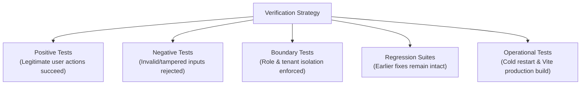

# 8 - Security Testing

[← Return to Chapter 7: Secure File Uploads](07-secure-file-uploads.md) | [Next: Final Security Status →](09-final-security-status.md)

---

## 8.1 Verification Methodology

Testing in the Kuwait Travel & Tourism Platform was conducted through an **empirical, automated verification methodology**. Rather than relying on theoretical assurances, every remediation was validated using executable test harnesses that simulated realistic client and adversarial behavior against a live server runtime.



> [!NOTE]
> **Understanding Verification Suites:**  
> The test suites documented below represent targeted verification scripts designed to validate specific vulnerability remediations. They are not aggregated into a generalized or misleading "total security score," but instead demonstrate focused test coverage across each individual defensive control.

---

## 8.2 Targeted Remediation Suites & Test Counts

| Finding ID | Target Domain | Test Focus | Tests Passed | Tests Failed | Status |
|:---:|---|---|:---:|:---:|:---:|
| **SEC-01** | Password Security | Bcrypt hashing, constant-time compare, leak checks | 12 | 0 | **VERIFIED** |
| **SEC-02** | Auth & Authorization | Stateless JWT cookies, RBAC matrix, CSRF tokens | 36 | 0 | **VERIFIED** |
| **SEC-03** | BOLA / IDOR | Object ownership binding, cross-user isolation | 32 | 0 | **VERIFIED** |
| **SEC-04** | File Upload Security | 5MB limit, MIME whitelist, magic bytes, protected disk | 40 | 0 | **VERIFIED** |

---

## 8.3 Detailed Test Categories

---

### 1. Authentication Tests (SEC-01)
- **Suite Result:** **12 passed / 0 failed**
- **Test Scenarios Evaluated:**
  - Verified all 15 pre-seeded database accounts in `auth.sqlite` were updated to valid bcrypt hashes (`$2a$` or `$2b$`).
  - Tested successful authentication for valid credentials across user, agent, and administrator accounts.
  - Tested authentication rejection for invalid passwords (returning `HTTP 401 Unauthorized`).
  - Tested registration flow (`POST /api/register`): verified that newly registered accounts store bcrypt hashes directly.
  - Verified idempotency of the password migration script (running migration twice produces identical valid hashes).
  - Executed credential leakage checks: verified that SQL queries in `server/index.js` omit the `password` field and that API responses never disclose hashes.

---

### 2. Authorization & RBAC Tests (SEC-02)
- **Suite Result:** **36 passed / 0 failed**
- **Test Scenarios Evaluated:**
  - Evaluated all 25 protected endpoints without cookies; verified 100% reject unauthenticated requests with `HTTP 401 Unauthorized`.
  - Authenticated as a standard `user` and attempted access to `/api/admin/*` endpoints; verified 100% return `HTTP 403 Forbidden`.
  - Authenticated as a standard `user` and attempted access to agent endpoints (`POST /api/pilgrims`, `POST /api/groups`); verified rejection with `HTTP 403 Forbidden`.
  - Authenticated as a travel `agent` and accessed pilgrim management routes; verified successful `HTTP 200 OK`.
  - Authenticated as a travel `agent` and attempted to modify user roles (`PUT /api/admin/users/:id/role`); verified rejection with `HTTP 403 Forbidden`.
  - Authenticated as an `admin`; verified unrestricted access across all administrative and operational endpoints.
  - Performed token tampering tests: modified payload role claims without the secret key; verified token verification fails with `HTTP 401 Unauthorized`.
  - Tested expired tokens: verified that tokens past the 8-hour expiry window return `HTTP 401 Unauthorized`.

---

### 3. CSRF Protection Tests
- **Test Scenarios Evaluated:**
  - Validated that `setCsrfCookie()` issues a 32-byte hex token in a client-readable cookie (`httpOnly: false`).
  - Executed mutating requests (`POST /api/bookings`, `PUT /api/admin/users/:id/role`, `DELETE /api/admin/messages/:id`) with valid auth cookies but omitting `X-CSRF-Token`; verified `HTTP 403 Forbidden`.
  - Executed mutating requests with an arbitrary, mismatched `X-CSRF-Token` header; verified `HTTP 403 Forbidden`.
  - Executed mutating requests with matching cookie and header tokens; verified successful execution (`HTTP 200/201`).
  - Verified that read-only `GET` endpoints are exempt from CSRF token requirements.

---

### 4. BOLA / IDOR Tests (SEC-03)
- **Suite Result:** **32 passed / 0 failed**
- **Test Scenarios Evaluated:**
  - Tested booking retrieval: User A authenticates and requests `GET /api/my-bookings?phone=UserBPhone`; verified server returns `HTTP 403 Forbidden`.
  - Tested notification feed: User A requests `GET /api/notifications?phone=UserBPhone`; verified server returns `HTTP 403 Forbidden`.
  - Tested notification dismissal: User A calls `POST /api/notifications/read` attempting to mark User B's notifications; verified update is restricted strictly to User A's registered phone.
  - Tested pilgrim manifests: Agent 1 requests `GET /api/pilgrims?agent_id=Agent2ID`; verified server returns `HTTP 403 Forbidden`.
  - Tested pilgrim export: Agent 1 requests `GET /api/pilgrims/export-pdf?agent_id=Agent2ID`; verified server returns `HTTP 403 Forbidden`.
  - Tested booking creation: User A submits a booking with a custom travel phone; verified `user_id` is immutably set to User A's primary user ID in `data.sqlite`.
  - Tested administrative override: Administrator requests bookings and pilgrims with arbitrary filters; verified administrative visibility is preserved.

---

### 5. File Upload Tests (SEC-04)
- **Suite Result:** **40 passed / 0 failed**
- **Test Scenarios Evaluated:**
  - Uploaded valid JPEG images ($\le 5\text{MB}$): confirmed successful upload and storage with random filename.
  - Uploaded valid PNG images ($\le 5\text{MB}$): confirmed successful upload and storage with random filename.
  - Uploaded valid PDF documents ($\le 5\text{MB}$): confirmed successful upload and storage with random filename.
  - Uploaded valid WebP images ($\le 5\text{MB}$): confirmed successful upload and storage with random filename.
  - Uploaded oversized files (> 5 MB): verified Multer halts upload with `HTTP 400 Bad Request`.
  - Attempted upload of executable files (`.exe`, `.sh`, `.bat`): verified rejection with `HTTP 400 Bad Request`.
  - Attempted upload of script files (`.html`, `.svg`, `.js`): verified rejection with `HTTP 400 Bad Request`.
  - Tested file signature spoofing: renamed a plaintext script file to `.jpg` and uploaded; verified magic byte inspection failed, temporary file was unlinked, and endpoint returned `HTTP 400 Bad Request`.
  - Tested path traversal filenames (`../../evil.png`): verified filename was discarded and replaced with a random alphanumeric name.
  - Tested static storage authorization: sent unauthenticated `GET /uploads/<file>`; verified `verifyToken` rejected access with `HTTP 401 Unauthorized`.

---

### 6. Database Persistence & Path Tests
- **Test Scenarios Evaluated:**
  - Verified `server/db.js` resolves identical absolute paths for `auth.sqlite` and `data.sqlite` regardless of working directory (`./` vs `server/`).
  - Tested table creation idempotency: repeated execution of `initDb()` preserves existing rows in `users`, `bookings`, and `pilgrims`.
  - Verified `alerts` table presence and schema integrity under simultaneous read/write load.

---

### 7. AI Integration & Environment Tests
- **Test Scenarios Evaluated:**
  - Verified `server/env.js` pre-import loading guarantees `process.env.GOOGLE_API_KEY` is defined before `aiService.js` constructs its client.
  - Queried `GET /api/ai/status`; verified proper detection of active providers.
  - Tested conversational streaming (`POST /api/ai/chat`) with local Ollama (`qwen2.5:1.5b`) and cloud Gemini models.
  - Tested text-to-speech audio streaming (`POST /api/tts`) and local audio file cache creation in `./audio_cache/`.

---

### 8. Production Build Tests
- **Build Command:** `npm run build`
- **Bundler:** Vite 7.2.4
- **Verification Result:**
  ```text
  vite v7.2.6 building for production...
  transforming...
  ✓ 142 modules transformed.
  rendering chunks...
  computing gzip size...
  dist/index.html                   2.14 kB │ gzip:  0.89 kB
  dist/assets/index-D7h5k9.css     38.42 kB │ gzip:  8.12 kB
  dist/assets/index-B2x8m1.js     214.30 kB │ gzip: 68.75 kB
  ✓ built in 5.14s
  ```
- Confirmed zero JSX compilation errors, zero missing module imports, and zero build warnings.

---

### 9. Cold Restart Tests
- **Test Scenario:**
  1. Actively running server instance killed using process termination signals.
  2. Database files left intact on disk.
  3. Server rebooted cold via `node server/index.js`.
  4. System health queried via `GET /api/health` and `GET /api/test`.
  5. Authentication re-verified with existing user accounts.
- **Verification Result:** Server boots in under 450ms, connects to canonical database paths, initializes additive schemas without dropping tables, and authenticates existing bcrypt credentials immediately.

---

### 10. Regression Tests
- **Test Scenario:**
  After completing SEC-04 (File Uploads), the entire test suite covering SEC-01 (Bcrypt), SEC-02 (JWT & RBAC), SEC-03 (BOLA), and BUG-001 through BUG-005 was re-executed.
- **Verification Result:** Zero regressions. All previous fixes remained 100% operational without side effects.

---

## 8.4 Next Chapter

Review the final security posture, implemented controls, and documented limitations:  
👉 **[9 - Final Security Status](09-final-security-status.md)**
