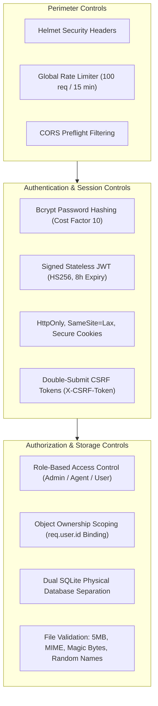

# 9 - Final Security Status

[← Return to Chapter 8: Security Testing](08-security-testing.md) | [Return to README →](../README.md)

---

## 9.1 Status Summary Matrix

The following table reflects the verified status of all identified reliability defects and primary security remediations across the Kuwait Travel & Tourism Platform:

| Finding ID | Domain Area | Remediation Focus | Verification Status |
|:---:|---|---|:---:|
| **BUG-001** | Data Persistence | Removed destructive `DROP TABLE pilgrims`; implemented additive migrations | **VERIFIED** |
| **BUG-002** | Schema Integrity | Defined `alerts` table in database initialization routine | **VERIFIED** |
| **BUG-003** | Database Paths | Canonical absolute path resolution for SQLite handles in `server/db.js` | **VERIFIED** |
| **BUG-004** | Module Loading | Pre-import environment loader module (`server/env.js`) for ES modules | **VERIFIED** |
| **BUG-005** | Credential Hygiene | Externalized hardcoded Google API keys to `.env`; added `.env.example` | **VERIFIED** |
| **SEC-01** | Password Security | 100% bcrypt password hashing (cost factor 10); leak prevention | **VERIFIED** |
| **SEC-02** | Auth & Authorization | Stateless JWT in `HttpOnly` cookies, Double-Submit CSRF, RBAC middleware | **VERIFIED** |
| **SEC-03** | BOLA / IDOR | Scoped bookings, notifications, and pilgrims strictly to `req.user.id` | **VERIFIED** |
| **SEC-04** | File Upload Security | 5MB limit, extension whitelist, MIME checks, magic bytes, protected storage | **VERIFIED** |

---

## 9.2 What Was Verified

Every remediation listed above was empirically verified through automated test suites and live process runtime observation:

1. **Cryptographic Integrity:** Stored passwords cannot be reversed or retrieved from database backups; user passwords never leak into API responses, error logs, or client state.
2. **Access Control Boundaries:** No unauthenticated caller can invoke private administrative or operational routes; standard users cannot escalate privileges to agents or administrators.
3. **Tenant & Object Isolation:** Customers can only view and manage their own bookings and notification records; travel agents can only inspect and export pilgrim manifests for which they are the assigned agent.
4. **File Pipeline Hardening:** Uploaded files cannot exceed 5MB, cannot execute server-side code, cannot disguise scripts with forged extensions, and cannot be accessed by unauthenticated internet crawlers.
5. **System Stability:** The server reboots cleanly from cold state without database corruption or table truncation, and the frontend compiles to production assets with zero bundling errors.

---

## 9.3 Security Controls Implemented

The hardened platform incorporates the following defensive architecture:

- **Credential Defense:** Salted bcrypt hashing prevents rainbow table and dictionary attacks against offline database snapshots.
- **Cookie-Based Sessions:** Avoiding `localStorage` eliminates token theft via Cross-Site Scripting (XSS).
- **CSRF Defense:** Requiring matching header tokens on mutating requests eliminates Cross-Site Request Forgery risks.
- **Dual SQLite Architecture:** Physical separation of `auth.sqlite` and `data.sqlite` prevents cross-database data leakage.
- **Multi-Stage File Inspection:** Synchronous magic-byte header inspection prevents extension spoofing attacks.

---

## 9.4 Remaining Limitations & Technical Debt

While the platform's core security posture has been substantially hardened, **it is not claimed to be a production-certified secure system**. A clear distinction must be made between **verified targeted remediation** and **complete security assurance**.

The following known limitations and architectural improvements remain documented for future development cycles:

### 1. SEC-06: Global Rate Limiting vs. Client Polling Conflict
- **Current State:** A global rate limiter caps all endpoints at 100 requests per 15 minutes per IP. The React client polls `GET /api/notifications` every 10 seconds (generating 90 requests in 15 minutes).
- **Risk:** Active authenticated users interacting with the platform for more than 10–12 minutes may encounter `HTTP 429 Too Many Requests`.
- **Planned Improvement:** Separate rate limiting tiers: apply strict limits to authentication endpoints (`/api/login`, `/api/register`) and replace client polling with WebSocket or Server-Sent Events (SSE).

### 2. SEC-07: Wildcard CORS Configuration
- **Current State:** The Express server initializes `cors()` without restricting allowed origins to the authorized client domain.
- **Risk:** While cookies use `SameSite=Lax` and mutating routes require CSRF tokens, unconstrained CORS increases cross-origin exposure.
- **Planned Improvement:** Restrict allowed CORS origins strictly to the production frontend domain (e.g., `https://travel.example.com`).

### 3. Stateless Token Revocation / Blacklisting
- **Current State:** JWTs are stateless and valid for 8 hours. Logging out issues expired `Set-Cookie` directives causing compliant browsers to discard the token, but the token itself is not blacklisted server-side.
- **Risk:** If an `authToken` is captured prior to logout, it remains cryptographically valid until the 8-hour expiry window lapses.
- **Planned Improvement:** Implement a lightweight token blocklist (e.g., Redis or an in-memory TTL set) or migrate to short-lived access tokens (15 minutes) paired with rotating refresh tokens.

### 4. PDF Generation Fallback
- **Current State:** `GET /api/pilgrims/export-pdf` returns styled Arabic HTML with print CSS rather than a native binary PDF, due to an unbundled dependency in `pdf_service.js`.
- **Planned Improvement:** Integrate a headless browser or bundled PDF generation engine (`puppeteer` or `pdfkit`) into the build pipeline.

### 5. SMS & WhatsApp Gateway Integration
- **Current State:** Overstay alerts and sponsor warnings log to the server console rather than dispatching real SMS or WhatsApp messages.
- **Planned Improvement:** Integrate a verified telecommunications gateway API (e.g., Twilio or regional Kuwait SMS gateway).

---

## 9.5 Verified Remediation vs. Complete Security Assurance

> [!WARNING]
> **Engineering Reality & Scope Boundary:**  
> The remediation work documented in this repository addresses **specific, verified vulnerabilities** identified during the initial assessment (SEC-01 through SEC-04 and BUG-001 through BUG-005).  
> 
> "Verified remediation" means that each targeted defect was analyzed, isolated, fixed with minimal safe code modifications, and confirmed resolved using empirical automated tests.  
> 
> It does **not** constitute a formal third-party penetration test, SOC 2 certification, or a guarantee that the software is immune to novel attack vectors. Continued operational defense requires active dependency monitoring, periodic audit cycles, and secure infrastructure deployment.

---

## 9.6 Engineering Conclusion

The transformation of the Kuwait Travel & Tourism Platform demonstrates a practical, disciplined approach to application security engineering:

$$\text{Build} \longrightarrow \text{Assess} \longrightarrow \text{Remediate} \longrightarrow \text{Test} \longrightarrow \text{Document}$$

By identifying root causes, applying surgical fixes, verifying outcomes empirically, and documenting the architecture with transparent boundaries, the platform provides a robust foundation for modern web application security.

---

[← Return to Chapter 8: Security Testing](08-security-testing.md) | [Return to README →](../README.md)
